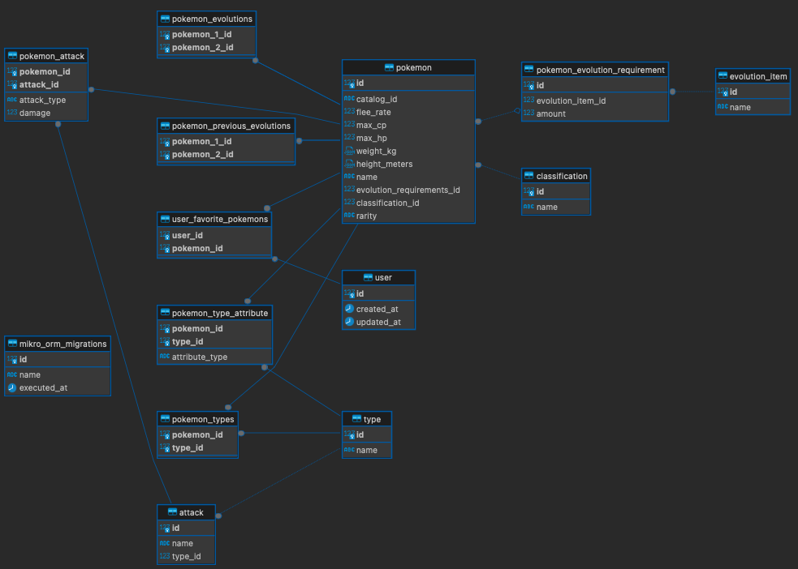

# Brainsoft BE Code Challenge solution

## How to start development server

```sh
cp .env.example .env.development
docker compose up
```

- Wait for server links to show up, but server should run at http://localhost:3000
- Swagger UI should run at http://localhost:3000/documentation

or

```sh
cp .env.example .env.development
yarn dev:docker or yarn dev:docker:prepare (for fresh image build)
```

## How to run tests

- First time running test run:

```sh
cp .env.example .env.test
yarn test:docker:prepare
```

- Additional runs can be invoked by

```sh
yarn test:docker
```

## Stop running containers, delete networks and volumes

```sh
yarn dev:docker:clean
```

```sh
yarn test:docker:clean
```

## ER Diagram


